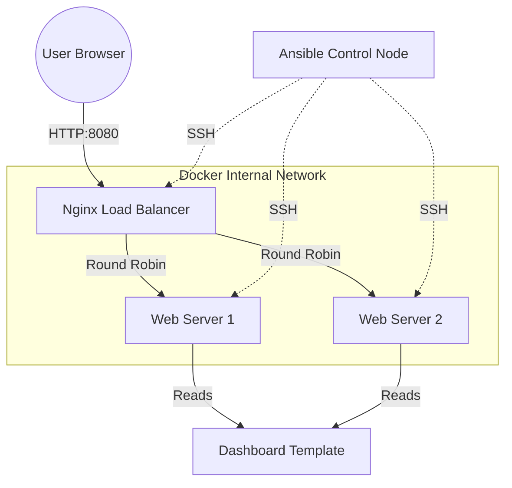

## Architecture



# Title: `Local High-Availability DevOps Cluster`

## 1. About the Project
> "This project provisions a 3-tier High Availability web architecture locally using **Terraform** (Infrastructure as Code) and configures it using **Ansible** (Configuration Management). It simulates a production-grade AWS environment using Docker containers to demonstrate zero-downtime deployment strategies."

## 2. Tech Stack
* **Infrastructure:** Terraform & Docker
* **Configuration:** Ansible (Jinja2 Templating)
* **Load Balancing:** Nginx (Upstream Module)

## 3. Key Features
* **Immutable Infrastructure:** Containers are provisioned from code, never manually created.
* **Dynamic Templating:** Web dashboards are generated dynamically based on server facts (RAM, IP, OS) using Ansible.
* **Traffic Shaping:** Nginx Load Balancer configured for Round-Robin traffic distribution with sticky-session removal.

## 4. Quick Start
### 1. Provision Infrastructure (Terraform)
Builds the Docker images, creates the network, and launches the containers.
```bash
cd terraform && terraform init && terraform apply -auto-approve
```

### 2. Configure Servers (Ansible) Installs Nginx, generates the dynamic dashboards, and configures the Load Balancer.
```bash
cd ../ansible && ansible-playbook playbook.yml
```

### 3. Verify Deployment Test the Load Balancer logic. Run this multiple times to see the server hostname change.

```bash
for i in {1..10}; do curl -s http://localhost:8080 | grep "web"; echo ""; done
```

> 
>open http://localhost:8080 in your browser
>

### 4. Clean up: Destroys all containers and networks.
```bash
cd ../terraform && terraform destroy -auto-approve
```


